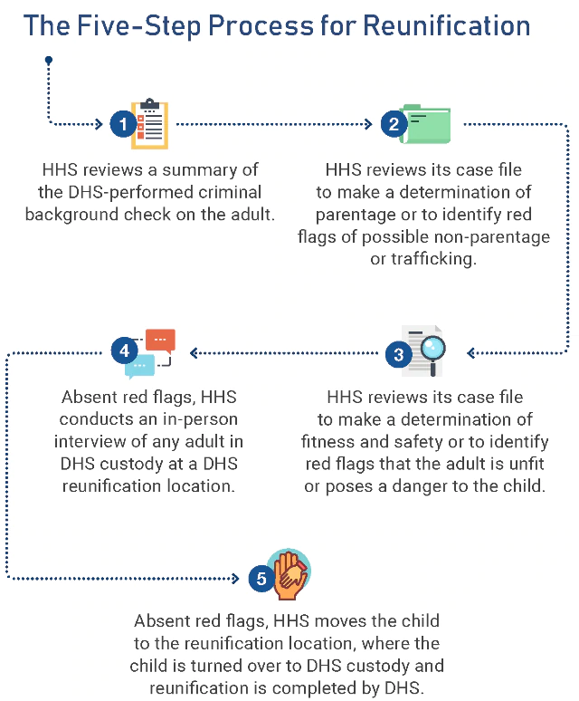

### Item 1: UAC-Tri-Department-Process
##### https://www.hhs.gov/about/news/2018/07/18/the-trump-administration-plan-for-reunifying-children.html?language=en
#### Published July 18, 2018 As Accessed July 25, 2018
#### EXCERPT

##### The Trump Administration Plan for Reunifying Children
Below is a summary of the reunification process that the Departments of Health and Human Services (HHS), Homeland Security (DHS), and Justice (DOJ) are implementing for eligible children over 5 years of age who may have been separated from their parents.

#### This document is intended to educate the public about the detailed interdepartmental reunification plan presented to the court. It does not represent new policy.

#### Graphic from the web page as of July 25, 2018

#### Read the full plan in the PDF File: UAC-Tri-Department-Process.pdf
